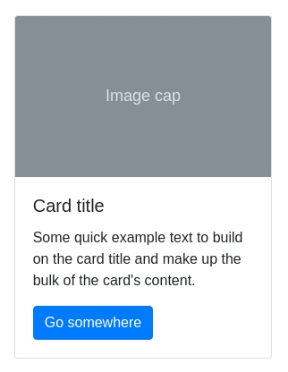

# week 1 day 3

Aşağıdakı şəkildə bir komponentləri yaradın:

1. Card komponenti. Burada istədiyiniz şəkili yerləşdirə bilərsiniz.(Rəng seçimində sərbəstsiniz)
`https://getbootstrap.com/docs/4.4/components/card/`

2. Navbar komponenti. (Rəng seçimində sərbəstsiniz)
`https://getbootstrap.com/docs/4.4/components/navbar/`

3. Form komponenti. (Rəng seçimində sərbəstsiniz) 
 `https://getbootstrap.com/docs/4.4/components/forms/`
